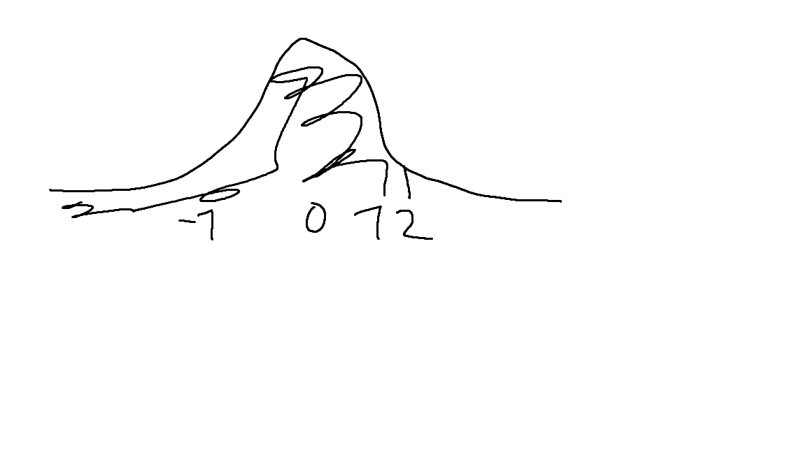
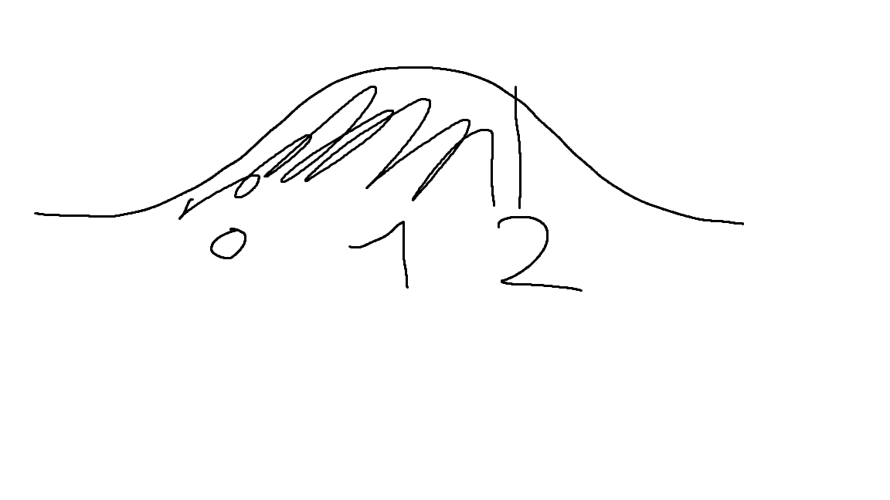

# Week 3

## 2.9

### 2.9.a

```pnorm(2)```
This uses the normal distribution to calculate the probability of a value being less than 2 standard deviations away from the mean.
P(X<2)



```pnorm(2,1,1)```
Normal distribution with mean 1 and standard deviation 1.
P(X<2)


```pnorm(2,1,2)```
Normal distribution with mean 1 and standard deviation 2.
P(X<2)



### 2.9.b

What is the result of the following command: qnorm(pnorm(2))?

```qnorm(pnorm(2))```
2, qnorm is the opposite of pnorm
so take the quantile of the probability of a value being less than 2 standard deviations away from the mean.

### 2.9.c

```qnorm(0.975)```
what is the quantile of 0.975% of the normal distribution?

```qnorm(0.975,1,1)```
what is the quantile of 0.975% of the normal distribution with mean 1 and standard deviation 1?

```qnorm(0.975,1,2)```
what is the quantile of 0.975% of the normal distribution with mean 1 and standard deviation 2?

## 2.10

### 2.10.a

Which of the following statements regarding the probability density func-
tion of the normal distribution N(1, 22) is false?

1. The total area under the curve is equal to 1.0
2. The mean is equal to 12
3. The variance is equal to 2
4. The curve is symmetric about the mean
5. The two tails of the curve extend indefinitely
6. Don’t know

3 is false, the variance is equal to 4

### 2.10.b

In R

## 2.11

### 2.11.a

in R

### 2.11.b

in R

## 2.12

### 2.12.a

in R

### 2.12.b

in Maple

## 2.13

in R
